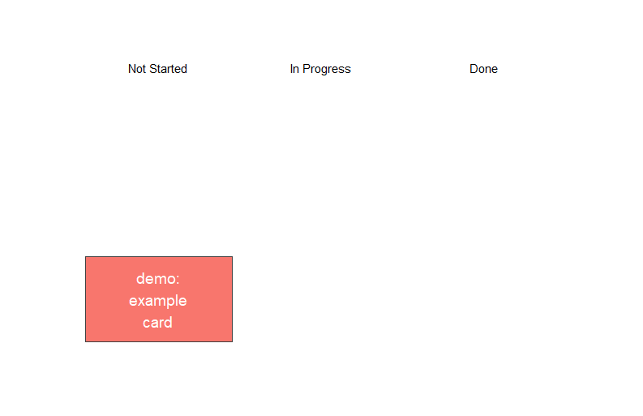

# r-kanban

Simple kanban with ggplot

```R
source(kanban.R)

# create the database
init_kanban()

# example to add a card, update its status, then delete it.
cards <- read_kanban()  
cards <- add_card(cards, 'a new card!', 'demo_blue', 'Not Started') 
cards <- update_status(cards, 'a new card!', 'In Progress') 
cards <- update_status(cards, 'a new card!', 'Done') 
cards <- delete_card(cards, 'a new card!')

# same example again but made cleaner with pipes
# runs all steps simultaneously 
init_kanban(overwrite = T)

read_kanban() %>%
  add_card('a new card!', 'demo_blue', 'Not Started') %>%
  update_status('a new card!', 'In Progress') %>%
  update_status('a new card!', 'Done') %>%
  delete_card('a new card!')


```

